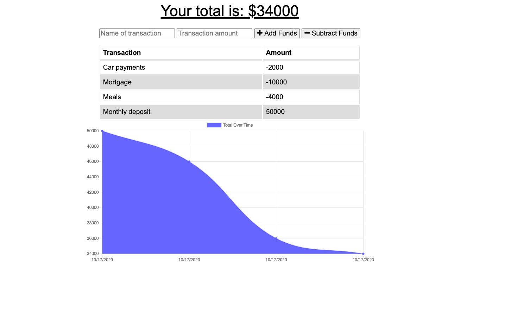

  # Online/Offline Budget Tracker

  
  ## Table of Contents

  - [Description](#description)
  - [User Story](#Story)
  - [Image](#image)
  - [Business Context](#businesscontext)
  - [Deployment](#deployment)
  - [Contributors](#contributors)
  - [Contact](#contact)

 

  ## Description

  The user will be able to add expenses and deposits to their budget with or without a connection. When entering transactions offline, they should populate the total when brought back online.

Offline Functionality:

  * Enter deposits offline

  * Enter expenses offline

When brought back online:

  * Offline entries should be added to tracker.

 ## User Story
  AS AN avid traveller
  I WANT to be able to track my withdrawals and deposits with or without a data/internet connection
  SO THAT my account balance is accurate when I am traveling

  
  

   ## Busines Context

  Giving users a fast and easy way to track their money is important, but allowing them to access that information anytime is even more important. Having offline functionality is paramount to our applications success.

  ## Deployment
  
  This app is deployed [here](https://mybudget-off-on.herokuapp.com/)
  

  ## Contributors

  Jonathan Davila

    
  
  ## Contact:

  For questions about this application please contact me at: 
  - [Github Profile](https://github.com/jdavila10)
  - j.eche589@gmail.com
  
    

